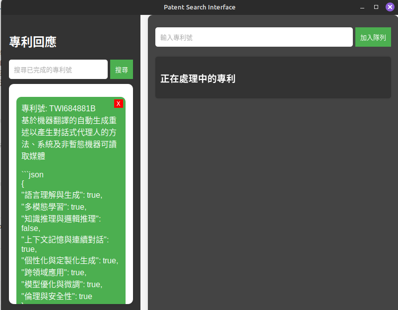

# 專利分類分析工具

## 介紹

鑒於專利數量龐大，查詢 Google Patent、複製摘要及描述並粘貼至 GPT，還需附上提問文字，這些繁瑣的操作往往會耗費大量時間。因此設計了使用免費 gemini api 的專利查詢工具<br>
用戶只需輸入專利號，系統便會自動完成從查詢專利到向 gemini 提問的全過程。並將結果以 JSON 格式進行總結，方便用戶進行查看和應用。<br>

## 檔案說明

此專案包含以下主要的檔案：

- **`patent_clawer.py`**：主程式，負責創建 GUI 介面並抓取輸入的專利號資料。
- **`apiCall.py`**：負責呼叫 gemini api。
- **`config.json`**：設定 prompt.txt 位置以及 api 設定。
- **`prompt.txt`**：提問用的文字檔，可根據需求進行修改。
- **`index.html`**： GUI 介面。


## 安裝與使用流程

1. **安裝所需套件**
   - 使用以下指令安裝必要的 Python 套件：
     ```bash
     pip install -r requirements.txt
     ```
2. **建立自己的 gemini api**
   - 具體步驟請見 [官方文檔](https://colab.research.google.com/#scrollTo=Wf5KrEb6vrkR)
   - 並將 api 貼到 config.json 中

3. **啟動主程式**
   - 執行以下指令啟動 `patent_clawer.py`：
     ```bash
     python patent_clawer.py
     ```
   - 此時，專利分類分析工具的 GUI 介面會顯示出來 (以下範例是有搜尋過的畫面)。
   - 

4. **輸入專利號**
   - 在右側輸入要查詢的專利號，並按下 "加入隊列" 按鈕。
   - 程式會擷取資料摘要及描述，並將 `prompt.txt` 的內容與擷取的資料合併成查詢語句，然後輸入到 api 的文字框中，展示在左側的對話框。
   - 如果想找尋之前查的內容，請在左側輸入要查詢的專利號，按下 "搜尋"，就能找到過去"已經"完成的紀錄。